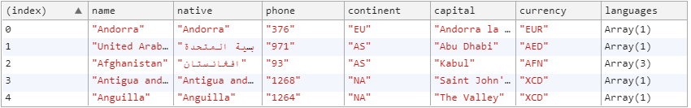
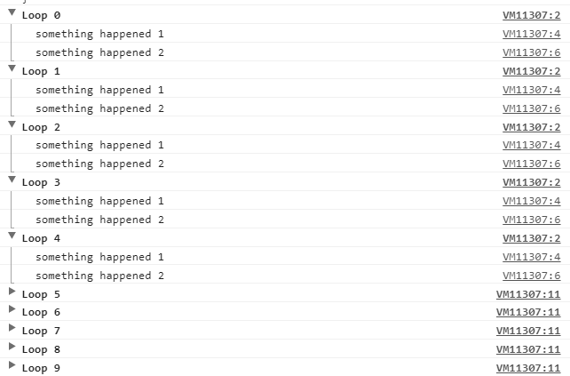

{{{
  "title": "Mastering the console methods",
  "tags": ["JavaScript", "August 2017", "console"],
  "date": "8-4-2017",
  "id": "08ac5cbc-3ee7-4740-9ccb-f22055ff7884",
  "description": "Going beyond console.log and exploring all the less known but very useful methods.",
  "publish": true
}}}

As JavaScript developers we probably find ourself logging stuff to the browser console many, MANY times. The `console.log()` method is an invaluable yet so simple tool to have and master.

For a long time, I myself used the `.log()` method only but there are so many other useful methods out there and I've seen them mentioned so few times, so here's a collection of them and how to use them.

## The evergreen: console.log()

Probably every JavaScript developer knows about this, as it's one of the first things we learn in web development. Nevertheless there are some nuances that might not be known to all.
```javascript
// Normal
const array = [1, 2, 3, 4];
console.log('String');
console.log('String', array);

// Interpolated
const country = 'Antartica';
console.log('I\'m from %s. And you?', country);

// Styled
const style = 'font-size: 30px; background-color: black; color: white;'
console.log('%cStyle console log', style);

// As we are printing strings, we can also use template literals
const dog = {
  breed: 'pug',
  name: 'Toby' 
}
console.log(`My dog is a ${dog.breed} and its name is ${dog.name}.`);
```


## Inform, warn or show errors
It's good practice to get rid of all console methods in production, but from time to time we might still need to show some information, detail or error. In these cases we have a few methods available to us to proper format the message.

```
// Info
console.info('Thank you for visiting this page.');

// Warning 
console.warn('Don\'t take candies from strangers! ');

// Error
console.error('Something went wrong, try reloading the page.');
```


## Console assertion

`console.assert()` allows us to run assertion as if we were writing a test.

I rarely used these methods but they might come in handy during interviews for instance. Let's say we get asked to write a function to reverse a string, why not adding some `console.assert()` for some simple testing?

```
// Reverse a string
function reverseStr(str) {
	return str.split('').reverse().join('');
}

// Assertion
const testCases = [{
    str: 'hello', 
    expected: 'olleh', 
    actual: reverseStr('hello') 
  }, { 
    str: 'this is a string', 
    expected: 'gnirts a si siht', 
    actual: reverseStr('hello') 
  }, {
    str: 'String with , and \'', 
    expected: '' dna , htiw gnirtS', 
    actual: reverseStr('hello') 
  }
];


testCases.forEach(testCase => 
console.assert(
  testCase.expected === testCase.actual, 
  `Reversed strings do not match. 
    Case: ${testCase.str} - 
    Expected: ${testCase.expected} - 
    Actual: ${testCase.actual}`
))
```


## Clean it up!

Quite straightforward: with `console.clear()` we can clear our console from previous logging. I never ended up using it but it's always good to know it exists.


## What was that method again?

Sometimes we might forget what methods are available for a given Object. When working with DOM elements and switching between Vanilla JS and jQuery, I often forget what methods I can use on one object or the other, if `forEach` work on the collections I get and so on.

`console.dir(obj)` to the rescue! Using it will give us a complete list of all the methods available on the object.


## Measure time

Have you ever wondered how long some function might take to completely run? Let's say we have found two different algorithms that solve the same problem and we want to know which one is faster. Or maybe we just want to know how much long certain functions or actions take to run in production. Too many times I've seen developers solving this issue by getting a `new Date()` at the beginning and at the end and see the difference. 

But there is an easier way: `console.time(stringId)`!

```
// How long does it take to populate an array with 10k items in a for loop?
const arr = [];

// start console.time() by feeding it with an identifier
console.time('arrayPopulation'); 
for (let i = 0; i < 10000; i++) {
	arr.push(i);
}

// terminate the timer with console.timeEnd() feeding it with the identifier
console.timeEnd('arrayPopulation');
```

Neat, huh?


## Never lose count again!

`console.count(stringId)` works like a counter which goes +1 everytime it gets called. This one is more interesting than useful from my point of view but it might come in handy from time to time.

```
// How many Fizz from 1 to 100? How many Buzz? How many FizzBuzz?
const countTo = 100;
for (let i = 1; i <= countTo; i++) {
  if (i % 3 === 0 && i % 5 === 0) {
    console.count('FizzBuzz');
  } else if (i % 3 === 0) {
    console.count('Fizz');
  } else if (i % 5 === 0) {
    console.count('Buzz');
  }
}
```


## Table for arrays and objects

Whenever we find yourself logging arrays or ojects to the console and clicking those small arrows to open each subgroup just to be able to see the content... make yuorself a favour and use `console.table()`!

With `console.table()` we can see the content of all items in our array/object at a glance and order each column alphabetically, in a nifty and clean table.

The only drawback is that nested arrays are not expanded, but it's still way better then checking each element one by one.
```
const countries = [{
    "name": "Andorra",
    "native": "Andorra",
    "phone": "376",
    "continent": "EU",
    "capital": "Andorra la Vella",
    "currency": "EUR",
    "languages": [
      "ca"
    ]
  },
  {
    "name": "United Arab Emirates",
    "native": "دولة الإمارات العربية المتحدة",
    "phone": "971",
    "continent": "AS",
    "capital": "Abu Dhabi",
    "currency": "AED",
    "languages": [
      "ar"
    ]
  },
  {
    "name": "Afghanistan",
    "native": "افغانستان",
    "phone": "93",
    "continent": "AS",
    "capital": "Kabul",
    "currency": "AFN",
    "languages": [
      "ps",
      "uz",
      "tk"
    ]
  },
  {
    "name": "Antigua and Barbuda",
    "native": "Antigua and Barbuda",
    "phone": "1268",
    "continent": "NA",
    "capital": "Saint John's",
    "currency": "XCD",
    "languages": [
      "en"
    ]
  },
  {
    "name": "Anguilla",
    "native": "Anguilla",
    "phone": "1264",
    "continent": "NA",
    "capital": "The Valley",
    "currency": "XCD",
    "languages": [
      "en"
    ]
  }
]
console.table(countries);
```
<a href="../images/_1/1_consoletable.png" target="_blank"></a>


## Grouping console.log

Sometime we find our console all stuffed with messages. Maybe because we have a `console.log()` in a loop or just because a function with multiple `console.log()` gets called many times. Whatever the reason, we can start reducing the amount of clutter by using grouping. As we will see below, there are two types of grouping: one is collapsed by default while the other isn't. Whichever we end up using, the benefit we get is that multiple logging are visually easy to browse and we can even nest multiple groups.

```
for (let i = 0; i < 5; i++) {
  console.group(`Loop ${i}`);
  // ...
  console.log('something happened 1');
  // ...
  console.log('something happened 2');
  // ...
  console.groupEnd(`Loop ${i}`)
}

for (let i = 5; i < 10; i++) {
  console.groupCollapsed(`Loop ${i}`);
  // ...
  console.log('something happened 1');
  // ...
  console.log('something happened 2');
  // ...
  console.groupEnd(`Loop ${i}`)
}
```
<a href="../images/_1/1_consolegroup.png" target="_blank"></a>


## Bonus methods

We are coming to the end of this maybe too long post, and we are getting into the territory of what I like to call `bonus methods` as their usage is fairly more complex than what we've seen so far. They don't simply log objects, strings or arrays to the console but they are actually more of a debugging tool.

### console.trace()

Calling it at any point in our code we will see a stack trace in our console everytime it runs. Let's say we add it at the beginning of a function: every time the function gets invoked we will be able to see the stack trace up to that point.


### console.profile()

It's equivalent to using the `Performance` tab in the Chrome Dev Tools, the difference is that the profiling starts and ends programmatically based on our needs.

```
// Start profiling
console.profile();

// Finish an ongoing profiling
console.profileEnd();

// Alternatively we can feed a string identifier if we need to run multiple profiling at once
console.profile(stringId);
console.profileEnd(stringId);
```

**NOTE**: the results of the profiles might not be available in your Chrome Dev Tool by default. To enable them, open the Dev Tool menu > More tools > JavaScript profiler


### monitor()

This is actually not a console method, but it's a window method we can use *inside* the console. We can call `monitor()` by giving it a function as a parameter. Every time that function gets called, `monitor` will print the parameter with which the function has been invoked. The example is easier to understand:

```
function reverseStr(str) {
  return str.split('').reverse().join('');
}

// In the console, NOT in the code, type
monitor(reverseStr);

// When we invoke the function...
reverseStr('hello');

// ... this will get printed to the console
function reverseStr called with arguments: hello
```

## Summary

There are many more console methods besides the most common `console.log()` and using them can help us in debugging and they can make us more productive as they are aimed at making our life in the console easier.

Here's a short summary:

```
console.log(obj) -> prints obj to the console
```

```
console.info(msg) -> prints msg to the console as an information
```

```
console.warn(msg) -> prints msg to the console as a warning
```

```
console.error(msg) -> prints msg to the console as an error
```

```
console.assert(condition, msg) -> asserts a condition and prints msg if the assertion fails
```

```
console.clear() -> clears the console from all previous content
```
 
```
console.dir(obj) -> prints a list of all the methods availabe on obj
```

```
console.time(stringId) + console.timeEnd(stringId) -> calculates time passed between .time() and .timeEnd()
```

```
console.count(stringId) -> counts +1 everytime it gets called with the same stringId
```

```
console.table(obj) -> prints an obj (or array) in a human readable, compact table
```

```
console.group(stringId)/console.groupCollapsed(stringId) + console.groupEnd(stringId) -> groups all console.log() between .group()/groupCollapsed() and groupEnd() under the same group for an easier formatting and closure of multiple console.log()
```

```
console.trace() -> prints a stack trace when called
```

```
console.profile() + console.profileEnd() -> profile what happens between start and end
```

```
monitor(fn) -> function available only in the console, prints every time fn gets called, together with the parameters that have been fed to it
```