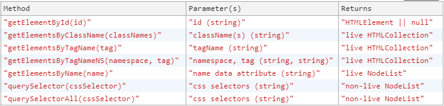

{{{
  "title": "JavaScript HTMLElements Selectors",
  "tags": ["JavaScript", "August 2017", "selectors", "HTML"],
  "date": "8-10-2017",
  "id": "c0b77ee1-d8de-4bd0-bde5-5df6ad37b352",
  "description": "Discovering and getting into all different JavaScript methods we can use to select HTMLElements.",
  "publish": true
}}}

When I first started writing this post I just wanted to show how different selectors perform compared to each other. While writing what I thought would be a **short** introduction to the different methods, I realised there are too many interesting things and quirks that I couldn't simply pass over.

So this post is going to focus on the methods used to select HTMLElements and the discussion on performances will be left for a different post.

## getElementById(id)

`getElementById(id)` it's by far the best as it returns as soon as it finds an element with the given `id`. This is thanks to the fact that `id`s are supposed to be unique. Even if wrong, defining multiple elements with the same `id` won't throw any error but it will create problems when selecting them.

**NOTE**: differently from other selectors, `getElementById(id)` can **only** be called on the `document` HTML node.

**PARAMETER**: id  
**RETURNS**: `HTML element` or `null` if nothing could be found.

---

## getElementsByClassName(classNames)

When we can't select by Id, a good alternative is to use one or more `className`s, separated by a space.

The return value looks like a normal array but it's actually a **live HTMLCollection object** containing all the child elements. This has two very important implications:

1. Being an object, array methods are not available. Might sound obvious but it still gets me from time to time

  ```javascript
  typeof document.getElementsByClassName('class') // object

  // This is not going to work, use a for loop instead
  document.getElementsByClassName('class').forEach(el => /* do something with el */);

  TypeError: document.getElementsByClassName(...).forEach is not a function
      at <anonymous>:1:3
  ```

2. Being a live colletion, you can run the selector once and its content wil always be up to date. An example:

  ```javascript
  const elementsByClassName = document.getElementsByClassName('testClass');
  // elementsByClassName.length === 0

  const newEl = document.createElement('div');
  newEl.className = 'testClass';
  document.body.appendChild(newEl);
  // elementsByClassName.length === 1

  // elementsByClassName has been updated to include the new element, without rerunning the selector
```

**PARAMETER**: string of space-separated class names  
**RETURNS**: `live HTMLCollection`

---

## getElementsByTagName(tag)

Alternatively we can also select all elements with a given tag (`div`, `a`, `p`, `pre`, etc etc).

On the [MDN web documentation](https://developer.mozilla.org/en-US/docs/Web/API/Element/getElementsByTagName) it's mentioned that

```
[...]
When called on an HTML element in an HTML document, getElementsByTagName put its argument in lower 
case before proceeding. This is undesirable when trying to match camel-cased SVG elements in a 
sub-tree in an HTML document. Element.getElementsByTagNameNS() works in that case.
[...]
```
but I couldn't find any proof of that and `getElementsByTagName('camelCaseTag')` seems to work just fine on Chrome.

**PARAMETER**: tag name  
**RETURNS**: `live HTMLCollection`

---

## getElementsByTagNameNS(namespace, tag)

I discovered this only at the time of writing and for what I could gather its usage is very rare. It's nevertheless a way of selecting DOM elements so here it goes.

`getElementsByTagNameNS(namespace, tag)` is quite similar to the `getElementsByTagName(tag)` above with the difference that the search is confined within elements under a specific namespace. An example is the best way to illustrate this:
```html
<!-- NOTE: below we are defining the xhtml namespace -->
<html xmlns="http://www.w3.org/1999/xhtml">
<head>
</head>
<body>
<div id="emptyXhtmlDiv"></div>
<!-- NOTE: below we are defining the svg namespace -->
  <svg xmlns="http://www.w3.org/2000/svg" id="image" version="1.1">
    <defs id="emptySvgDefs"></defs>
  </svg>
</body>
</html>
```

```javascript
const xhtmlDivs = document.getElementsByTagNameNS('xhtml', 'div');
// returns [div#emptyXhtmlDiv]

const svgDefs = document.getElementsByTagNameNS('svg', 'defs')
// returns [defs#emptySvgDefs]

const xhtmlDefs = document.getElementsByTagNameNS('xhtml', 'defs');
// returns [] empty object as the element with tag defs is not under the namespace xhtml but it's under svg instead

const svgDiv = document.getElementsByTagNameNS('svg', 'div')
// returns [] empty object as the element with tag div is not under the namespace svg but it's under xhtml instead
```

**PARAMETERS**: namespace, tag name  
**RETURNS**: `live HTMLCollection`

---

## getElementsByName(name)

This can be used to retrieve all DOM elements with a given `name` attribute. Reading the [MDN web documentation](https://developer.mozilla.org/en-US/docs/Web/API/Document/getElementsByName) it seems that on IE<10 browsers `getElementsByName(name)` will also include elements with `id === name` in the return value. Fun!

Note that this method returns a `live NodeList` instead of an `HTMLCollection`. There is not much difference beside the methods that we can use, such as our beloved `forEach()` that is not available on `HTMLCollection`s.

```javascript
document.getElementsByName(name).__proto__
/*
entries: fn(...)
forEach: fn(...)
item: fn(...)
keys: fn(...)
length: fn(...)
values: fn(...)
*/
```

**PARAMETER**: data attribute name  
**RETURNS**: `live NodeList`

## querySelector(cssSelector) and querySelectorAll(cssSelector)

We reached the end of our list of methods. The two we are covering now are quite powerful as they use `cssSelectors` to find `HTMLElements`. This means that we can use literally **anything** in just one method: `id`s, `data` attributes, `className`s, `:not`, `:first-child`, `:last-of-type` and much more!

Both methods use the same exact logic to find all `HTMLElements` following the given `cssSelector`s. The only difference is in the return value:
- `querySelector(cssSelector)` returns only the first HTMLElement in the list of all HTMLElements satisfying the selectors
- `querySelectorAll(cssSelector)` returns the whole list

We will go into the details of the logic used by these two methods to find the elements in just a minute, but first let me add an important note:  
**NOTE**: the methods return a `non-live NodeList`, this means that if you run the `query` once and then something change in the elements satisfying the query, those changes will not be reflected in your first `query` and you will have to run it again.

```html
<body>
  <div class="test"></div>
  <div class="test"></div>
  <div class="test"></div>
</body>
```
```javascript
const result = document.querySelectorAll('.test');
// result.length === 3

const newEl = document.createElement('div');
newEl.className = 'test';
document.body.appendChild(newEl);

// result.length === 3 -> result has not been updated to include the newly created element.

const resultUpdated = document.querySelectorAll('.test');
// resultUpdated.length === 4
```

And now to the interesting bit: yet again I used the [MDN web documentation](https://developer.mozilla.org/en-US/) as it's very well written, and while checking information on `querySelector()` I found this disclaimer:

```
The matching is done using depth-first pre-order traversal of the document's 
nodes by first element in document markup and iterating through sequential 
nodes by order of amount of child nodes).
```

At first it was absolutely obscure to me what it meant, but running a few examples it became all clear. What the disclaimer is saying - I think, is that given one or more `cssSelectors`, the methods will collect all the elements that satisfy the selectors and they will return them in order of appearance in the HTMLDocument. All tests I ran seem to confirm that.

```html
<div id="container1" class="container">
    <div class="test" id="a"></div>
    <div class="test" id="b"></div>
</div>
<div id="container2" class="container">
    <div class="test" id="c"></div>
</div>
```
```javascript
document.querySelector('.container #c') 
// returns <div class="test" id="c"></div> as expected
```
```javascript
document.querySelector('.container') 
// returns <div id="container1" class="container"></div>, as it's the first one of the two div with class 'container' to appear in the DOM
```
```javascript
// Now things get interesting!
document.querySelector('.container #c, .container') 
// returns <div id="container1" class="container"></div>
```

But how come does it return the element satisfying the second cssSelector(.container) if we have a valid firts cssSelector(.container #c)?

Going back to the disclaimer again, it all makes sense: the method first check for all HTMLElements satisfying the query and then returns the first one in order of appearance.

```javascript
// Elements satisfying the query are:
// .container #c -> <div class="test" id="c"></div>
// .container -> [<div id="container1" class="container"></div>, <div id="container2" class="container"></div>]
```

And the first one to appear in the DOM is indeed `<div id="container1" class="container">`.

The logic used by `querySelectorAll()` is exactly the same, in fact by running it we find that:
```javascript
document.querySelectorAll('.container #c, .container') 
// returns [div#container1.container, div#container2.container, div#c.test]
```

**PARAMETER**: css selectors  
**RETURNS**: `non-live NodeList`

---

## Summary

As mentioned in the beginning this whole post was supposed to be a short introduction to the different JS methods available to us for selecting DOM Elements, but it quickly got out of hands as there are multiple quirks and interesting notes that I felt I should point out while on the subject. As we covered a lot of stuff, here's a table recapping all methods, complete with parameters and return values.

<a href="../images/_2/2_js_methods_selectors.png" target="_blank"></a>
