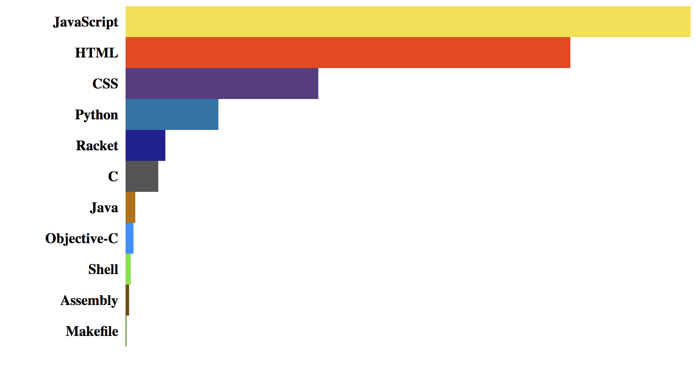

{{{
  "title": "GitHub widget Tutorial - Part 2",
  "tags": ["JavaScript", "September 2017", "Tutorial", "API", "Functional Programming", "GitHub"],
  "date": "9-2-2017",
  "id": "e6dfa1c0-115b-4d11-a299-15f933a48562",
  "description": "Build a widget using JavaScript and the GitHub API - Part 2",
  "publish": true
}}}

This is the second part of the tutorial on how to create a JavaScript widget displaying all the languages we used in our GitHub repos.

The whole tutorial covers the following:
1. Use GitHub API
2. Aggregate API response data
2. Create HTML widget through vanilla JS
3. Update widget as API responses come in

In this first part we saw how to get and format the data we receive from the GitHub API, while in this second part we will take care of the rendering.

<a href="../images/_3/result.png" target="_blank"></a>

**NOTES**:

You can find the code for the first part <a href="https://gist.github.com/NicolaFerracin/ab4ad6a2004d633164cbe06d36af8027" target="_blank" title="GitHub Widget Tutorial Part 1">here >></a>. 

The complete code can be found <a target="_blank" href="https://gist.github.com/NicolaFerracin/c017b812a722c031f7b337b8981c3259">here >></a>.

## Where were we?

The last thing we did in the first part was to create a sorted array of arrays at the end of our `getLanguagesForRepo()` function, containing all languagese used, with the most used coming first. Something looking like this:

```javascript
[
    ['JavaScript', 9000],
    ['Python', 8736],
    ['C++', 6256],
    ['language', number_of_bytes]
]
```

Are you ready to display some data?


## Drawing the chart

Let's start by creating a method which we can use to update our chart everytime new data comes in. This method will then take care of either:
- draw the chart for a new language
- or update an existing language's chart

```javascript
function getLanguagesForRepo(url) {
    // Omitted code
    
    // this is the last thing we wrote in the previous post
    const sortedLangs = Object.keys(allLanguages)
        .map(lang => [lang, languages[lang]])
        .sort((a, b) => b[1] - a[1]);

    // new function invocation
    updateChart(sortedLangs);
};

function updateChart(langs) {
    // we know that we are receiving a sorted array so we can safely extract the number of bytes
    // of the first language, which represents how many bytes we wrote with the most
    // used language. This will be useful at the moment of determining the length of our chart.
    const max = langs[0][1];

    // now we need to loop through every language and draw it to the screen!
    langs.forEach(lang => {
        
        // and here we need to decide if we either draw a new line for a new language 
        // or update an existing one.
        // To do that, we can simply check if we already have a line with id === language
        if (document.getElementById(lang[0])) {
            updateLine(lang, max)
        } else {
            createNewLine(lang, max);
        }
    });
}

// Stubs
function createNewLine(lang, max) {};
function updateLine(lang, max) {};
```

So, in our `updateChart()` method we are not drawing anything, we are simply looping through all the languages we retrieved up to that point in time and deciding if we need to create a new line in our chart or update an existing line.

We also extracted the number of bytes of the most used language as this number will represent the 100% length of the chart, and all subsequent languages will be proportional to that. We will see this in a moment.

### Drawing new languages

The first time we receive some data from the API, all languages in our array are new, in the sense that we don't have an existing chart to update, we instead need to draw new data to screen. And we do this in our `createNewLine()` method.

First of all, we need to decide how we want a single line to look like:

```html
<!-- Wrapper -->
<div id="{language}">
    <!-- Label -->
    <div>{languageName}</div>
    <!-- Bar -->
    <div class="bar"></div>
</div>

```

```javascript
// let's start by adding a variable holding the chart wrapper at the top of our file
const chart = document.getElementById('gitHubChart');

// in our new method we need to append to the chart a new line representing a particular language
function createNewLine(lang, max) {    
    // let's create some elements based on our HTML blueprint here above
    const line = document.createElement('div');
    const label = document.createElement('div');
    const bar = document.createElement('div');

    // let's set an ID so we can easily check if we have a line for a given language in the future
    line.setAttribute('id', lang[0]);
    line.style.display = 'flex';

    // define label
    label.innerText = lang[0];
    // we are now going to define styles one by one.
    // Alternatively we could define them in one go as a string
    // using element.style.cssText = 'string-of-styles';
    label.style.width = '19%';
    label.style.textAlign = 'right';
    label.style.paddingRight = '1%';
    label.style.alignSelf = 'center';
    label.style.fontFamily = 'monospace';
    label.style.fontSize = '1.5em';
    
    // define bar
    // if the most used language represents 100% of length, than we can easily calculate the length of any
    // other given language. The proportion is "most_used_language : 100 = given_language : x"
    // where x is the length of the given language chart
    bar.style.width = lang[1] * 100 / max + '%';
    bar.className = 'bar';
    bar.style.height = '35px';
    bar.style.maxWidth = '80%';
    bar.style.borderTopRightRadius = '35px';
    bar.style.borderBottomRightRadius = '35px';

    // Append all newly created elements
    line.appendChild(label);
    line.appendChild(bar);
    chart.appendChild(line);
};
```

Here we go! The biggest chunk of work is now done. By running this code, everytime we receive data for a new language from the API, it will be displayed to the screen. But we are not quite done yet, in fact every additional byte we might receive from the API will not get printed to the screen.

We are going to fix this next.

### Updating languages

Let's do a quick recap: we have data coming in, we have a chart on the screen and we now need to update it to display new information. If you remember, we added an ID attribute for every line representing a different language, so we can easily get existing lines.

```javascript
function updateLine(lang, max) {
    // get the line
    line = document.getElementById(lang[0]);

    // get the bar, which is the critical piece we need to udpate. The label and the wrapper won't change
    bar = line.getElementsByClassName('bar')[0];
    
    // let's use the same formula we used above to determine the new length of the language chart
    // "most_used_language : 100 = given_language : x" where x is the length of the given language chart
    bar.style.maxWidth = lang[1] * 100 / max + '%';
}
```

That's it! As long as we properly set up the chart on the first render, then updating it is very easy.

## A splash of color

Yes, we do have a working chart, but let's be honest: our chart is quite ugly. Since every language is usually associated with a specific color, wouldn't it be nice if we could color each bar with that specific language color?

What we first need, is a list of colors for all the languages out there. A quick Google search brought me [here](https://github.com/doda/github-language-colors/blob/master/colors.json), where you can find a json object containing - if not all, most of the languages' colors out there. Without complicating this too much, we can just store the json as a variable in the same `.js` file or in a separate one. If you use a separate file, just remember to include it in your HTML.

```javascript
const colors = {
    "Mercury": "#ff2b2b",
    "TypeScript": "#2b7489",
    "PureBasic": "#5a6986",
    ...
}
```

Now we need to color our chart somewhere in our code, and the best place is probably during the first rendering, in the `createNewLine()` function.

```javascript
function createNewLine(lang, max) {
    // ...
    bar.style.width = lang[1] * 100 / max + '%';
    bar.className = 'bar';
    
    // using the language name, we can extract its color from our colors object
    bar.style.backgroundColor = colors[lang[0]];
    // ...
}
```

## Summary

We are done!

We now have a widget making API calls and constantly updating to the screen, in less than 100 lines and without using external dependencies, just plain JavaScript.

There are a few things that could be improved (styling and API response error handling, to cite a couple) but this is nevertheless a good starting point in case you want to add this widget to you portfolio or personal page, as it is.

Did you find any error? Was it useful to you? Leave any feedback or comment below, and happy coding!